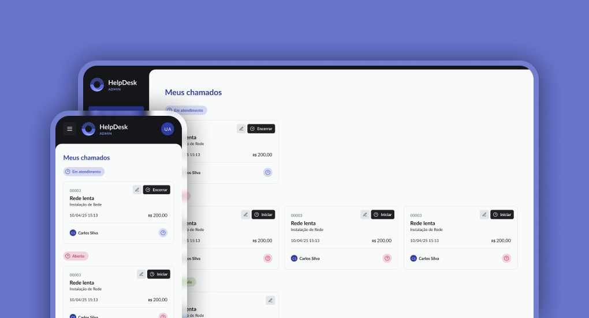

<p align="center">
  <a href="#-tecnologias">Tecnologias</a>&nbsp;&nbsp;&nbsp;|&nbsp;&nbsp;&nbsp;
  <a href="#-projeto">Projeto</a>&nbsp;&nbsp;&nbsp;|&nbsp;&nbsp;&nbsp;
  <a href="#-layout">Layout</a>&nbsp;&nbsp;&nbsp;|&nbsp;&nbsp;&nbsp;
  <a href="#memo-licença">Licença</a>
</p>

<p align="center">
 

  
</p>

<br>

<p align="center">
  
</p>

## 🚀 Tecnologias

Esse projeto foi desenvolvido com as seguintes tecnologias:

- HTML
- CSS
- Typescript
- React
- Tailwind
- Vite
- NodeJs
- Zod
- Axios

## 💻 Projeto

HelpDesk é um sistema de Gerenciamento de Chamados.

## 🔖 Layout

Você pode visualizar o layout do projeto através [desse link](https://www.figma.com/pt-br/comunidade/file/1506654636739959765/plataforma-de-chamados). É necessário ter conta no [Figma](https://figma.com) para acessá-lo.

## 🔥 Executando o projeto

### Pré-requisito

- [NodeJS v20.19.0 (LTS)](https://nodejs.org/en/download)

### Passo a Passo
```
# Clone o repositório
$ git clone https://github.com/jessebenevenuto/fullstack-challenge-helpdesk.git

# Acesse a pasta do projeto no terminal
$ cd caminho-do-projeto/fullstack-challenge-helpdesk

# Abra o projeto no VSCode (ou na IDE de sua preferência)
$ code .

# Instale as dependências do projeto
$ npm install ou npm i

# Execute a API
$ npm run server
> Abra o navegador e digite o endereço -> http://localhost:5173
```

## 📝 Licença

Esse projeto está sob a licença MIT. Veja o arquivo [LICENSE](.github/LICENSE.md) para mais detalhes.

---

Feito com 💜 by Rocketseat :wave: [Participe da nossa comunidade!](https://discordapp.com/invite/gCRAFhc)

<!--START_SECTION:footer-->

<br />
<br />

<p align="center">
  <a href="https://discord.gg/rocketseat" target="_blank">
    
  </a>
